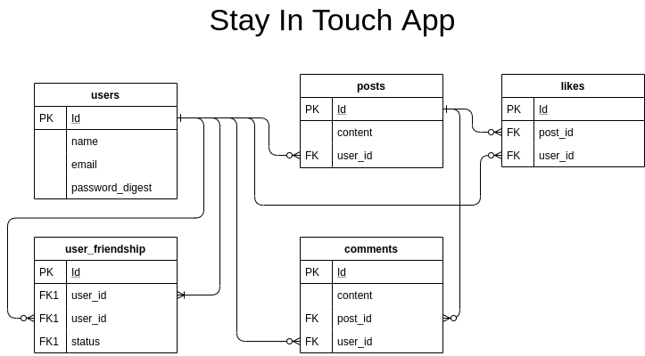

<h1 align="center">[Rails] Associations / Events App </h1>
<p>
  
  <a href="#" target="_blank">
    
  </a>
  <a href="https://twitter.com/ae_cordova" target="_blank">
    
  </a>
  <a href="https://twitter.com/redacuve" target="_blank">
    
  </a>
</p>

___
## Description of the project 

The purpose of this project is to practice Rails acquired knowledge by building an app called Stay in Touch Where a user can Sign in, share Posts and connect with other users as Friends, thus be able to see their posts in his Timeline.

<h3 align="center">Data Model Representation</h3>
<p align="center">
  
</p>


### ⭐️ Built with
* Ruby on Rails 6
* HTML5 and Sass
* Capybara
* RSpec

### Dev Environment Requirements:
* Ruby needs to be installed to run the code, check [here](https://www.ruby-lang.org/en/documentation/installation/) for further steps


### ⭐️ Running the code

#### Live Version:

You can find a live running version of this app on the following link: [Stay In Touch](https://mighty-basin-95377.herokuapp.com/users/sign_in)

#### Instructions for running on local environment:

1. Clone the repo

2. Navigate to the root directory

3. Run bundle install to ensure all the needed gems are installed:
    ```
    $ bundle install
    ```
3. Run Yarn Install
    ```
    $ yarn install --check-files
    ```
3. Migrate the DB
    ```
    $ rails db:migrate
    ```
3. Run Rails Server
    ```
    $ rails server
    ```
3. Open localhost:3000 on a browser to get to the home page
    ```
    https://localhost:3000
    ```
### ⭐️ How it works

1. Go to the Home Page and click on the  Sign Up button

2. Fill up your information, name, email, password and confirmation are required.

3. The app will automatically sing you in. (If you already have signed up previously, Click on the Login link on the nav bar, and fill up your email and password.)

4. Once you're logged in the rest of the options appear, 
   
   * Click on the All Users To see a list of all users that have signed up to the app.  
   
   * You can send a friend request by clicking on the Add Friend button on both a Users Profile or the All Users page, a friend request notification will appear on the other user's profile.

   * To see your profile, click on the Logged as: [User Name] section of the NavBar, there, you will see your info, your posts and any incoming friend requests

   * Click on the Accept or Decline options to respond to an incoming friend request.

   * Once a friend request is accepted you will be friends with the other user and his posts will appear on your timeline.

   * To create a Post, Click on the Stay In Touch link of the NavBar, fill up the post information and press Save.

   * To comment on a Post, you can see a text field under such post, fill it up and press the Comment button.

   * To Like a post, click on the Like! link on the top right of such post. Click again to un-like it.
   
   * Only you and your friends will be able to see your posts

<!-- CONTRIBUTING -->
## Contributing

Any contributions you make are **greatly appreciated**.

1. Fork the Project
2. Create your Feature Branch (`git checkout -b feature/AmazingFeature`)
3. Commit your Changes (`git commit -m 'Add some AmazingFeature'`)
4. Push to the Branch (`git push origin feature/AmazingFeature`)
5. Open a Pull Request


## Authors

👤 **Rey David Cuevas** 
* Github: [@redacuve](https://github.com/https:\/\/github.com\/redacuve)  

👤 **Angel Cordova** 
* Github: [@aecordova](https://github.com/https:\/\/github.com\/aecordova)  
